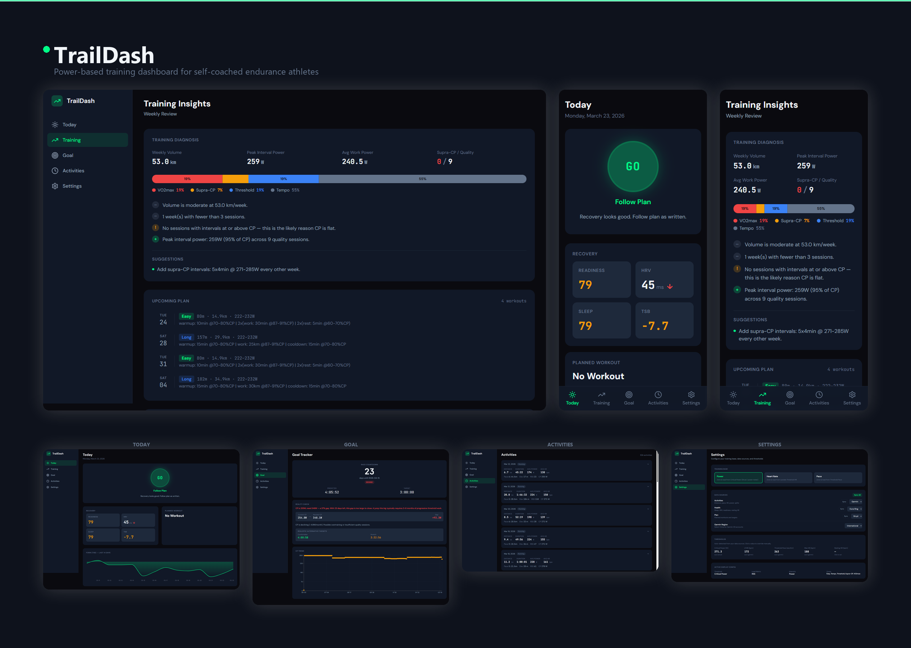
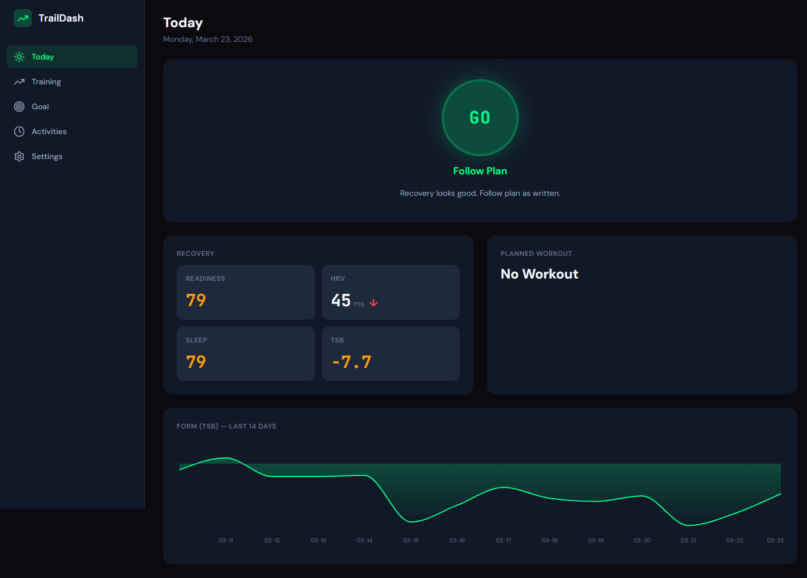
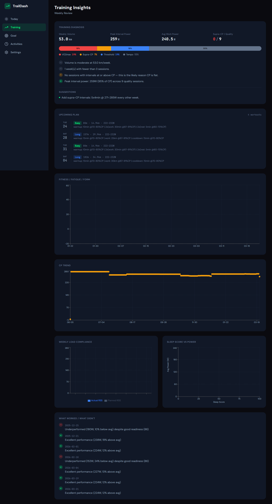

# Trainsight

Data-driven self-coaching for runners of all levels. Combines your GPS, power, heart rate, sleep, and recovery data into actionable training insights and race predictions — so you can train smarter, not just harder.

Currently supports running (road and trail). Data sources: Garmin, Stryd, Oura Ring.



## Features

- **Daily training signal** — GO/MODIFY/REST recommendation based on load + recovery
- **Training diagnosis** — split-level power analysis identifying what's helping or holding back your CP
- **Race/goal tracking** — race countdown with predicted time, or CP milestone progress
- **Fitness & fatigue charts** — CTL/ATL/TSB, CP trend, weekly compliance
- **Recovery insights** — sleep-performance correlation, HRV trends, fatigue warnings
- **Activity history** — drill into per-split power breakdowns

| Today | Training Insights |
|-------|-------------------|
|  |  |

## Architecture

```
sync/           → Garmin/Stryd/Oura API sync scripts → data/**/*.csv
analysis/       → Metric computation (metrics.py, data_loader.py)
api/            → FastAPI backend serving computed data as JSON
web/            → Vite + React + TypeScript + Tailwind v4 frontend
tests/          → pytest test suite
```

## Quick Start (with Sample Data)

No API credentials needed — sample data gets you running immediately:

```bash
# 1. Set up Python
python -m venv .venv
source .venv/Scripts/activate   # Windows/Git Bash
# source .venv/bin/activate     # macOS/Linux
pip install -r requirements.txt

# 2. Seed sample data
python scripts/seed_sample_data.py

# 3. Start the API
python -m uvicorn api.main:app --reload

# 4. Start the frontend (new terminal)
cd web
npm install
npm run dev
```

Open http://localhost:5173

## Quick Start (with Real Data)

```bash
# 1. Set up credentials
cp sync/.env.example sync/.env
# Edit sync/.env with your Garmin, Stryd, Oura API tokens

# 2. Sync data (with historical backfill)
python -m sync.sync_all --from-date 2025-12-01

# 3. Start API + frontend (same as above)
python -m uvicorn api.main:app --reload
cd web && npm run dev
```

## Data Sources

| Source | Data | How |
|--------|------|-----|
| **Garmin Connect** | GPS, HR, elevation, cadence, VO2max, per-split power | garminconnect library |
| **Stryd** | Running power, CP estimate, RSS, form metrics | Stryd web API |
| **Oura Ring** | Sleep quality, HRV, readiness score, body temp | Oura API v2 |

## Dashboard Modes

Configured via the **Goal** page UI (stored in `data/config.json`):

- **Race Goal** — set a race date + optional target time + distance. Shows countdown, predicted time, CP gap analysis
- **Continuous Improvement** (default) — optional target time + distance. Shows CP progress, milestones, trend projection

Distance options: 5K, 10K, Half Marathon, Marathon, 50K, 50 Mile, 100K, 100 Mile

## Running Tests

```bash
python -m pytest tests/ -v
```

## Contributing

See [CLAUDE.md](CLAUDE.md) for architecture details, conventions, and how to add new metrics or data sources. See [AGENTS.md](AGENTS.md) for AI-assisted development workflows.
