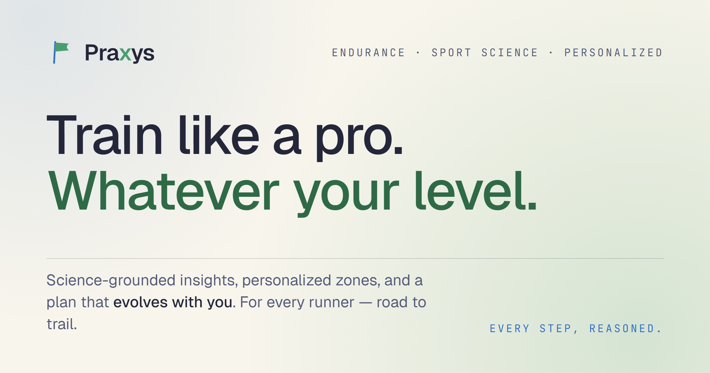

# Praxys

Sports science that meets you where you are. Praxys syncs data from Garmin, Stryd, and Oura Ring, computes training metrics (fitness/fatigue/form, zone analysis, CP trend, race predictions), and serves a modern web dashboard with AI-powered coaching skills — for elite athletes, serious amateurs, and curious beginners alike.



> **Note:** Praxys is the new name for the project formerly known as Trainsight. The on-disk database file (`trainsight.db`) and legacy `TRAINSIGHT_*` environment variables continue to work during the deprecation window — see [`docs/brand/index.html`](docs/brand/index.html) for the brand guideline.

## Where to Run It

| Surface | URL | Notes |
|---------|-----|-------|
| Web app | [`www.praxys.run`](https://www.praxys.run) | React SPA on Azure App Service; apex `praxys.run` redirects here. |
| Backend API | [`api.praxys.run`](https://api.praxys.run) | FastAPI on Azure App Service (East Asia). JWT-auth on every route except `/api/register` and `/api/token`. |
| WeChat Mini Program | `miniapp/` (Taro 4 + React) | Authenticates against the same backend via `/api/auth/wechat/*`. Build with `npm run build:weapp` and load `dist/` in WeChat DevTools. |
| AI plugin | `plugins/praxys/` | 8 skills + a dual-mode MCP server (local SQLite, or remote against `api.praxys.run`). |

**Cloud app (recommended):** register, connect your platforms, sync data, view the dashboard from anywhere. AI features are available via the Praxys plugin in remote mode.

**Local development:** the same codebase runs locally — start the backend and frontend dev servers, register as the first user (becomes admin), and you are up and running.

## Quick Start (Local Development)

```bash
# 1. Install Python dependencies
pip install -r requirements.txt

# 2. Configure environment
cp .env.example .env
python -c "from cryptography.fernet import Fernet; print(Fernet.generate_key().decode())"
# Add the generated key as PRAXYS_LOCAL_ENCRYPTION_KEY in .env

# 3. Start the API server
python -m uvicorn api.main:app --reload

# 4. Start the frontend dev server (separate terminal)
cd web && npm install && npm run dev

# 5. Open http://localhost:5173 and register as the first user (becomes admin)
```

For sample data without API credentials: `python scripts/seed_sample_data.py`

## What's Inside

- **Pure-function metrics** in `analysis/metrics.py` — fitness/fatigue/form, CP trend, zone distribution, Riegel + Stryd race predictions, all with source citations.
- **Pluggable data sources** in `analysis/providers/` — Garmin Connect, Stryd, Oura Ring v2, plus an optional AI provider for plan generation.
- **Multi-user from day one** — JWT auth, invitation-based registration, Fernet-encrypted platform credentials, per-user Garmin token directories.
- **Decoupled frontend host** — `frontend_server/` is a standalone App Service site (`praxys-frontend`), so the same `web/dist/` artifact can later sit behind Tencent COS for a CN audience without Azure-specific glue.
- **Designed for scientific rigor** — every formula carries a citation, every estimate is flagged, the `science-reviewer` and `metric-addition-reviewer` agents enforce the discipline on every change.

## Documentation

- [Brand Guideline](docs/brand/index.html)
- [Getting Started](docs/getting-started.md)
- [Security](docs/security.md)
- [Architecture](docs/dev/architecture.md)
- [Deployment](docs/deployment.md)
- [CLI Skills](docs/skills.md)
- [Features](docs/features.md)
- [API Reference](docs/dev/api-reference.md)
- [Contributing](docs/dev/contributing.md)
- [Webhook Feasibility (Oura + Garmin)](docs/studies/webhook-feasibility.md)

## Legal

### License

Praxys is released under the [MIT License](LICENSE).

### Trademarks

Garmin, Stryd, Oura, COROS, and WeChat are trademarks of their respective owners. Praxys is not affiliated with, endorsed by, or sponsored by any of these companies. Logos and names are used solely to identify the data sources the app can sync from.

### Third-party data sources

- **Garmin Connect** — synced via the unofficial [`garminconnect`](https://github.com/cyberjunky/python-garminconnect) Python library. There is no official Garmin partnership; the integration depends on Garmin's consumer web endpoints continuing to work. Garmin's [Terms of Use](https://www.garmin.com/en-US/legal/general-terms-of-use/) restrict automated access — use at your own risk.
- **Stryd** — synced via the same email/password endpoints the Stryd web app uses. There is no official partner API for individual users. Same risk class as Garmin.
- **Oura Ring** — synced via the [official Oura API v2](https://cloud.ouraring.com/v2/docs) using a Personal Access Token. This is a supported integration path.
- **COROS** — synced via the unofficial Training Hub web API (activities, HRV, resting HR, VO2max) and the reverse-engineered mobile API (sleep data). There is no official COROS partnership. Same risk class as Garmin.

### Where your data lives

- **Self-hosted (local development or your own Azure deployment):** all data sits in your own SQLite database. You control the host, the backups, and who has access.
- **Cloud app at `praxys.run`:** your activity, recovery, and goal data are stored in our managed Azure deployment. Your **platform credentials** (Garmin password, Stryd password, Oura access token) are protected with **envelope encryption** — per-user Fernet DEKs wrapped by a KEK held outside the database — so they're never stored in plaintext, never returned to the frontend, and never logged. Activity and recovery data themselves are not encrypted at the application layer beyond standard storage-level encryption. See [`docs/security.md`](docs/security.md) for the full scheme.
